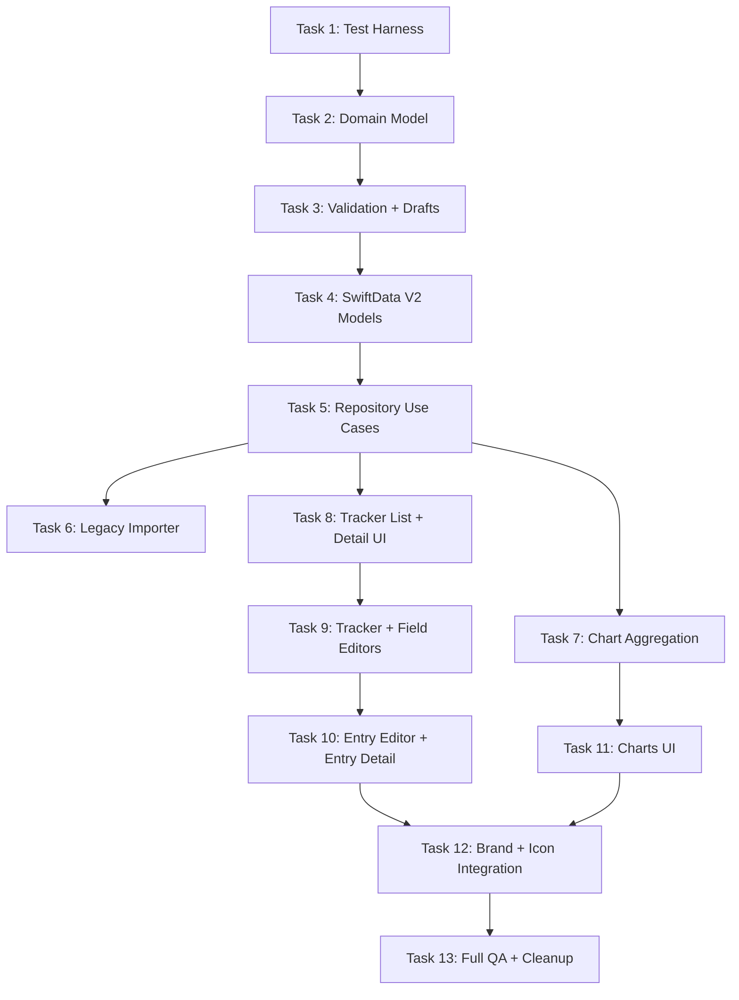

# Personal Tracker Rewrite Implementation Plan

> **For agentic workers:** REQUIRED SUB-SKILL: Use superpowers:subagent-driven-development (recommended) or superpowers:executing-plans to implement this plan task-by-task. Steps use checkbox (`- [ ]`) syntax for tracking.

**Goal:** Rewrite the current Diary app into a private native iOS Personal Tracker with stable field identity, typed entries, local SwiftData persistence, native charts, a polished app identity, and automated verification.

**Architecture:** Add a testable domain layer for trackers, fields, entries, validation, and chart aggregation. Add SwiftData v2 models plus a repository/use-case layer; keep legacy Diary models available long enough to import existing local data. Rewire SwiftUI around tracker-first screens with native navigation, accessible controls, and deterministic UI test launch options.

**Tech Stack:** Swift 5, SwiftUI, SwiftData, Charts, Swift Testing, XCTest UI tests, Xcode 16.2 project with file-system-synchronized groups, iOS 18.2 deployment target.

---

## Subagent Work Graph



Parallel lanes after Task 5:

- **Model + Persistence Agent:** Tasks 2, 3, 4, 5, 6.
- **Charts Agent:** Task 7, then Task 11 with the UI agent.
- **UI + Accessibility Agent:** Tasks 8, 9, 10, 11, 12.
- **QA Agent:** Task 1, then test expansion and Task 13.
- **Main Thread:** final app name and icon approval before Task 12 ships.

## File Structure

Create:

- `Diary/Domain/TrackerDomain.swift`: stable IDs, field definitions, entry values, tracker structs.
- `Diary/Domain/TrackerDrafts.swift`: editable draft types for forms.
- `Diary/Domain/TrackerValidation.swift`: validation errors and field/value validation.
- `Diary/Persistence/ModelContainerFactory.swift`: app/test model container creation and launch arguments.
- `Diary/Persistence/TrackerModels.swift`: SwiftData v2 tracker, field, entry, and value models.
- `Diary/Persistence/TrackerRepository.swift`: transactional create/update/fetch use cases.
- `Diary/Persistence/LegacyDiaryImporter.swift`: old Diary-to-Tracker import bridge.
- `Diary/Charts/TrackerCharting.swift`: pure chart aggregation service.
- `Diary/Design/AppBrand.swift`: display name, accent color, icon naming notes, copy constants.
- `Diary/Views/TrackerListView.swift`: root tracker list and empty state.
- `Diary/Views/TrackerDetailView.swift`: tracker home with entries, fields, and insights links.
- `Diary/Views/TrackerEditorView.swift`: create/edit tracker shell.
- `Diary/Views/FieldEditorView.swift`: field create/edit sheet.
- `Diary/Views/EntryEditorView.swift`: typed entry form.
- `Diary/Views/EntryDetailView.swift`: stable snapshot display.
- `Diary/Views/TrackerChartsView.swift`: chart controls and native chart rendering.
- `DiaryTests/TrackerDomainTests.swift`: stable identity and value behavior.
- `DiaryTests/TrackerValidationTests.swift`: validation coverage.
- `DiaryTests/TrackerPersistenceTests.swift`: SwiftData v2 persistence coverage.
- `DiaryTests/LegacyDiaryImporterTests.swift`: local migration/import coverage.
- `DiaryTests/TrackerChartingTests.swift`: chart aggregation coverage.
- `DiaryUITests/PersonalTrackerFlowTests.swift`: deterministic smoke flow.

Modify:

- `Diary/DiaryApp.swift`: use `ModelContainerFactory`, launch arguments, and `TrackerListView`.
- `Diary/Assets.xcassets/AccentColor.colorset/Contents.json`: set final accent color.
- `Diary/Assets.xcassets/AppIcon.appiconset/Contents.json`: point to generated app icon assets.
- `Diary.xcodeproj/project.pbxproj`: update `INFOPLIST_KEY_CFBundleDisplayName` after final name approval.
- `DiaryUITests/DiaryUITests.swift`: remove template launch-only test or replace with smoke assertions.
- `DiaryUITests/DiaryUITestsLaunchTests.swift`: keep screenshot launch test but use deterministic arguments.

Keep during migration:

- `Diary/schema/Diary.swift`
- `Diary/schema/Entry.swift`
- `Diary/schema/Field.swift`
- `Diary/schema/SampleDiaryList.swift`

Remove after Task 13 if no longer referenced:

- `Diary/Views/DiaryListView.swift`
- `Diary/Views/ShowDiaryView.swift`
- `Diary/Views/CreateDiaryView.swift`
- `Diary/Views/CreateEntryView.swift`
- `Diary/Views/ShowEntryView.swift`
- `Diary/Views/EditFieldModal.swift`
- `Diary/Views/ChartsView.swift`

## Task 1: Test Harness And Launch Options

**Owner:** QA Agent

**Files:**

- Create: `Diary/Persistence/ModelContainerFactory.swift`
- Modify: `Diary/DiaryApp.swift`
- Create: `DiaryUITests/PersonalTrackerFlowTests.swift`

- [ ] **Step 1: Write the failing seeded-launch UI test**

```swift
import XCTest

final class PersonalTrackerFlowTests: XCTestCase {
    override func setUpWithError() throws {
        continueAfterFailure = false
    }

    @MainActor
    func testSeededTrackerAppearsOnLaunch() throws {
        let app = XCUIApplication()
        app.launchArguments = ["-ui-testing", "-reset-store", "-seed-sample-data"]
        app.launch()

        XCTAssertTrue(app.staticTexts["Mood Tracker"].waitForExistence(timeout: 5))
    }
}
```

- [ ] **Step 2: Run the UI test and verify it fails**

Run:

```bash
/Applications/Xcode.app/Contents/Developer/usr/bin/xcodebuild -project Diary.xcodeproj -scheme Diary -destination 'platform=iOS Simulator,name=iPhone 16 Pro' -only-testing:DiaryUITests/PersonalTrackerFlowTests/testSeededTrackerAppearsOnLaunch test
```

Expected: FAIL because the app has no UI testing launch-argument seed path yet.

- [ ] **Step 3: Add launch arguments and a model container factory**

Add `Diary/Persistence/ModelContainerFactory.swift`:

```swift
import Foundation
import SwiftData

enum AppLaunchOptions {
    static var isUITesting: Bool {
        ProcessInfo.processInfo.arguments.contains("-ui-testing")
    }

    static var shouldSeedSampleData: Bool {
        ProcessInfo.processInfo.arguments.contains("-seed-sample-data")
    }
}

@MainActor
enum ModelContainerFactory {
    static func makeModelContainer() -> ModelContainer {
        let schema = Schema([
            Diary.self,
            EntryDef.self,
            Entry.self,
            FieldDef.self,
        ])
        let configuration = ModelConfiguration(
            schema: schema,
            isStoredInMemoryOnly: AppLaunchOptions.isUITesting
        )

        do {
            let container = try ModelContainer(for: schema, configurations: [configuration])
            if AppLaunchOptions.shouldSeedSampleData {
            seedLegacySampleData(in: container.mainContext)
            }
            return container
        } catch {
            fatalError("Could not create ModelContainer: \(error)")
        }
    }

    static func seedLegacySampleData(in context: ModelContext) {
        let tracker = Diary.sampleData()
        tracker.name = "Mood Tracker"
        context.insert(tracker)
        do {
            try context.save()
        } catch {
            fatalError("Could not seed sample data: \(error)")
        }
    }
}
```

Modify `Diary/DiaryApp.swift` so the app uses `ModelContainerFactory.makeModelContainer()`.

- [ ] **Step 4: Run the seeded-launch UI test and verify it passes**

Run the same `xcodebuild` command from Step 2.

Expected: PASS and the launched app shows `Mood Tracker`.

- [ ] **Step 5: Commit**

```bash
git add Diary/Persistence/ModelContainerFactory.swift Diary/DiaryApp.swift DiaryUITests/PersonalTrackerFlowTests.swift
git commit -m "test: add deterministic personal tracker launch harness"
```

## Task 2: Domain Model With Stable Field Identity

**Owner:** Model + Persistence Agent

**Files:**

- Create: `Diary/Domain/TrackerDomain.swift`
- Create: `DiaryTests/TrackerDomainTests.swift`

- [ ] **Step 1: Write failing domain tests**

```swift
import Foundation
import Testing
@testable import Diary

struct TrackerDomainTests {
    @Test func fieldRenameKeepsStableID() {
        let fieldID = FieldID()
        var tracker = Tracker(
            id: TrackerID(),
            name: "Mood Tracker",
            fields: [
                TrackerFieldDefinition(id: fieldID, name: "Mood", type: .number, sortOrder: 0)
            ],
            entries: [],
            createdAt: Date(timeIntervalSince1970: 0),
            updatedAt: Date(timeIntervalSince1970: 0)
        )

        tracker.renameField(id: fieldID, to: "Energy")

        #expect(tracker.fields[0].id == fieldID)
        #expect(tracker.fields[0].name == "Energy")
    }

    @Test func entryValueRendersFromSnapshotAfterRename() {
        let fieldID = FieldID()
        let snapshot = FieldSnapshot(id: fieldID, name: "Mood", type: .number, sortOrder: 0)
        let entry = TrackerEntry(
            id: EntryID(),
            createdAt: Date(timeIntervalSince1970: 10),
            fieldSnapshots: [snapshot],
            values: [fieldID: .number(7.5)]
        )

        #expect(entry.displayRows()[0].label == "Mood")
        #expect(entry.displayRows()[0].value == "7.5")
    }
}
```

- [ ] **Step 2: Run the domain tests and verify they fail**

Run:

```bash
/Applications/Xcode.app/Contents/Developer/usr/bin/xcodebuild -project Diary.xcodeproj -scheme Diary -destination 'platform=iOS Simulator,name=iPhone 16 Pro' -only-testing:DiaryTests/TrackerDomainTests test
```

Expected: FAIL because the domain types do not exist.

- [ ] **Step 3: Implement the domain types**

Add `Diary/Domain/TrackerDomain.swift`:

```swift
import Foundation

struct TrackerID: Hashable, Codable, Identifiable {
    let rawValue: UUID
    var id: UUID { rawValue }

    init(_ rawValue: UUID = UUID()) {
        self.rawValue = rawValue
    }
}

struct FieldID: Hashable, Codable, Identifiable {
    let rawValue: UUID
    var id: UUID { rawValue }

    init(_ rawValue: UUID = UUID()) {
        self.rawValue = rawValue
    }
}

struct EntryID: Hashable, Codable, Identifiable {
    let rawValue: UUID
    var id: UUID { rawValue }

    init(_ rawValue: UUID = UUID()) {
        self.rawValue = rawValue
    }
}

enum TrackerFieldType: String, Codable, CaseIterable, Identifiable {
    case text
    case number
    case date
    case time
    case selector

    var id: String { rawValue }
}

struct TrackerFieldDefinition: Identifiable, Hashable, Codable {
    var id: FieldID
    var name: String
    var type: TrackerFieldType
    var sortOrder: Int
    var options: [String]
    var minValue: Double?
    var maxValue: Double?

    init(
        id: FieldID = FieldID(),
        name: String,
        type: TrackerFieldType,
        sortOrder: Int,
        options: [String] = [],
        minValue: Double? = nil,
        maxValue: Double? = nil
    ) {
        self.id = id
        self.name = name
        self.type = type
        self.sortOrder = sortOrder
        self.options = options
        self.minValue = minValue
        self.maxValue = maxValue
    }
}

struct FieldSnapshot: Identifiable, Hashable, Codable {
    var id: FieldID
    var name: String
    var type: TrackerFieldType
    var sortOrder: Int
}

enum EntryValue: Hashable, Codable {
    case text(String)
    case number(Double)
    case date(Date)
    case time(DateComponents)
    case selector(String)
    case unavailable(String)

    var displayValue: String {
        switch self {
        case .text(let value), .selector(let value):
            return value
        case .number(let value):
            return String(value)
        case .date(let value):
            return EntryValueFormatters.date.string(from: value)
        case .time(let components):
            let hour = components.hour ?? 0
            let minute = components.minute ?? 0
            return String(format: "%02d:%02d", hour, minute)
        case .unavailable(let reason):
            return reason
        }
    }
}

enum EntryValueFormatters {
    static let date: DateFormatter = {
        let formatter = DateFormatter()
        formatter.locale = Locale(identifier: "en_US_POSIX")
        formatter.dateFormat = "yyyy-MM-dd"
        return formatter
    }()
}

struct EntryDisplayRow: Equatable {
    var label: String
    var value: String
}

struct TrackerEntry: Identifiable, Hashable, Codable {
    var id: EntryID
    var createdAt: Date
    var fieldSnapshots: [FieldSnapshot]
    var values: [FieldID: EntryValue]

    func displayRows() -> [EntryDisplayRow] {
        fieldSnapshots
            .sorted { $0.sortOrder < $1.sortOrder }
            .map { snapshot in
                EntryDisplayRow(
                    label: snapshot.name,
                    value: values[snapshot.id]?.displayValue ?? ""
                )
            }
    }
}

struct Tracker: Identifiable, Hashable, Codable {
    var id: TrackerID
    var name: String
    var fields: [TrackerFieldDefinition]
    var entries: [TrackerEntry]
    var createdAt: Date
    var updatedAt: Date

    mutating func renameField(id: FieldID, to name: String) {
        guard let index = fields.firstIndex(where: { $0.id == id }) else { return }
        fields[index].name = name
        updatedAt = Date()
    }
}
```

- [ ] **Step 4: Run domain tests and verify they pass**

Run the command from Step 2.

Expected: PASS.

- [ ] **Step 5: Commit**

```bash
git add Diary/Domain/TrackerDomain.swift DiaryTests/TrackerDomainTests.swift
git commit -m "feat: add tracker domain model"
```

## Task 3: Drafts And Validation

**Owner:** Model + Persistence Agent

**Files:**

- Create: `Diary/Domain/TrackerDrafts.swift`
- Create: `Diary/Domain/TrackerValidation.swift`
- Create: `DiaryTests/TrackerValidationTests.swift`

- [ ] **Step 1: Write failing validation tests**

```swift
import Foundation
import Testing
@testable import Diary

struct TrackerValidationTests {
    @Test func emptyTrackerNameIsInvalid() {
        let draft = TrackerDraft(name: " ", fields: [])
        #expect(TrackerValidator.validateTracker(draft).contains(.emptyTrackerName))
    }

    @Test func numberValueRejectsText() {
        let field = TrackerFieldDefinition(name: "Energy", type: .number, sortOrder: 0)
        let result = TrackerValidator.validate(value: .text("high"), for: field)
        #expect(result == .wrongValueType(fieldName: "Energy"))
    }

    @Test func selectorRequiresKnownOption() {
        let field = TrackerFieldDefinition(
            name: "Tag",
            type: .selector,
            sortOrder: 0,
            options: ["Work", "Health"]
        )
        let result = TrackerValidator.validate(value: .selector("Travel"), for: field)
        #expect(result == .invalidSelectorOption(fieldName: "Tag", option: "Travel"))
    }
}
```

- [ ] **Step 2: Run validation tests and verify they fail**

Run:

```bash
/Applications/Xcode.app/Contents/Developer/usr/bin/xcodebuild -project Diary.xcodeproj -scheme Diary -destination 'platform=iOS Simulator,name=iPhone 16 Pro' -only-testing:DiaryTests/TrackerValidationTests test
```

Expected: FAIL because draft and validation types do not exist.

- [ ] **Step 3: Implement drafts and validation**

Add `Diary/Domain/TrackerDrafts.swift`:

```swift
import Foundation

struct TrackerDraft: Equatable {
    var name: String
    var fields: [TrackerFieldDraft]
}

struct TrackerFieldDraft: Identifiable, Equatable {
    var id: FieldID
    var name: String
    var type: TrackerFieldType
    var sortOrder: Int
    var options: [String]
    var minValue: Double?
    var maxValue: Double?

    init(
        id: FieldID = FieldID(),
        name: String,
        type: TrackerFieldType,
        sortOrder: Int,
        options: [String] = [],
        minValue: Double? = nil,
        maxValue: Double? = nil
    ) {
        self.id = id
        self.name = name
        self.type = type
        self.sortOrder = sortOrder
        self.options = options
        self.minValue = minValue
        self.maxValue = maxValue
    }
}

struct EntryDraft {
    var trackerID: TrackerID
    var createdAt: Date
    var values: [FieldID: EntryValue]
}
```

Add `Diary/Domain/TrackerValidation.swift`:

```swift
import Foundation

enum TrackerValidationError: Equatable, LocalizedError {
    case emptyTrackerName
    case emptyFieldName
    case duplicateFieldName(String)
    case selectorWithoutOptions(fieldName: String)
    case wrongValueType(fieldName: String)
    case invalidSelectorOption(fieldName: String, option: String)
    case numberBelowMinimum(fieldName: String, minimum: Double)
    case numberAboveMaximum(fieldName: String, maximum: Double)

    var errorDescription: String? {
        switch self {
        case .emptyTrackerName:
            return "Tracker name is required."
        case .emptyFieldName:
            return "Field name is required."
        case .duplicateFieldName(let name):
            return "\"\(name)\" is already used."
        case .selectorWithoutOptions(let fieldName):
            return "\"\(fieldName)\" needs at least one option."
        case .wrongValueType(let fieldName):
            return "\"\(fieldName)\" has an incompatible value."
        case .invalidSelectorOption(let fieldName, let option):
            return "\"\(option)\" is not an option for \"\(fieldName)\"."
        case .numberBelowMinimum(let fieldName, let minimum):
            return "\"\(fieldName)\" must be at least \(minimum)."
        case .numberAboveMaximum(let fieldName, let maximum):
            return "\"\(fieldName)\" must be at most \(maximum)."
        }
    }
}

enum TrackerValidator {
    static func validateTracker(_ draft: TrackerDraft) -> [TrackerValidationError] {
        var errors: [TrackerValidationError] = []
        if draft.name.trimmingCharacters(in: .whitespacesAndNewlines).isEmpty {
            errors.append(.emptyTrackerName)
        }

        var seenNames = Set<String>()
        for field in draft.fields {
            let name = field.name.trimmingCharacters(in: .whitespacesAndNewlines)
            if name.isEmpty {
                errors.append(.emptyFieldName)
            } else if seenNames.contains(name.lowercased()) {
                errors.append(.duplicateFieldName(name))
            }
            seenNames.insert(name.lowercased())
            if field.type == .selector && field.options.isEmpty {
                errors.append(.selectorWithoutOptions(fieldName: name))
            }
        }
        return errors
    }

    static func validate(value: EntryValue, for field: TrackerFieldDefinition) -> TrackerValidationError? {
        switch (field.type, value) {
        case (.text, .text), (.date, .date), (.time, .time), (.selector, .selector), (.number, .number):
            break
        default:
            return .wrongValueType(fieldName: field.name)
        }

        if case .selector(let option) = value, !field.options.contains(option) {
            return .invalidSelectorOption(fieldName: field.name, option: option)
        }

        if case .number(let value) = value {
            if let minValue = field.minValue, value < minValue {
                return .numberBelowMinimum(fieldName: field.name, minimum: minValue)
            }
            if let maxValue = field.maxValue, value > maxValue {
                return .numberAboveMaximum(fieldName: field.name, maximum: maxValue)
            }
        }

        return nil
    }
}
```

- [ ] **Step 4: Run validation tests and verify they pass**

Run the command from Step 2.

Expected: PASS.

- [ ] **Step 5: Commit**

```bash
git add Diary/Domain/TrackerDrafts.swift Diary/Domain/TrackerValidation.swift DiaryTests/TrackerValidationTests.swift
git commit -m "feat: add tracker drafts and validation"
```

## Task 4: SwiftData V2 Models

**Owner:** Model + Persistence Agent

**Files:**

- Create: `Diary/Persistence/TrackerModels.swift`
- Modify: `Diary/Persistence/ModelContainerFactory.swift`
- Create: `DiaryTests/TrackerPersistenceTests.swift`

- [ ] **Step 1: Write failing persistence tests**

```swift
import Foundation
import SwiftData
import Testing
@testable import Diary

@MainActor
struct TrackerPersistenceTests {
    @Test func persistsTrackerWithStableFieldID() throws {
        let container = try ModelContainerFactory.makeTestingContainer()
        let context = container.mainContext
        let fieldID = UUID()
        let tracker = TrackerModel(name: "Mood Tracker")
        tracker.fields.append(FieldDefinitionModel(
            fieldID: fieldID,
            name: "Energy",
            typeRaw: TrackerFieldType.number.rawValue,
            sortOrder: 0
        ))

        context.insert(tracker)
        try context.save()

        let fetched = try context.fetch(FetchDescriptor<TrackerModel>())
        #expect(fetched.count == 1)
        #expect(fetched[0].fields[0].fieldID == fieldID)
    }
}
```

- [ ] **Step 2: Run persistence tests and verify they fail**

Run:

```bash
/Applications/Xcode.app/Contents/Developer/usr/bin/xcodebuild -project Diary.xcodeproj -scheme Diary -destination 'platform=iOS Simulator,name=iPhone 16 Pro' -only-testing:DiaryTests/TrackerPersistenceTests test
```

Expected: FAIL because the v2 SwiftData models do not exist.

- [ ] **Step 3: Implement SwiftData v2 models**

Add `Diary/Persistence/TrackerModels.swift`:

```swift
import Foundation
import SwiftData

@Model
final class TrackerModel {
    @Attribute(.unique) var trackerID: UUID
    var name: String
    var createdAt: Date
    var updatedAt: Date

    @Relationship(deleteRule: .cascade)
    var fields: [FieldDefinitionModel]

    @Relationship(deleteRule: .cascade)
    var entries: [EntryModel]

    init(
        trackerID: UUID = UUID(),
        name: String,
        createdAt: Date = Date(),
        updatedAt: Date = Date(),
        fields: [FieldDefinitionModel] = [],
        entries: [EntryModel] = []
    ) {
        self.trackerID = trackerID
        self.name = name
        self.createdAt = createdAt
        self.updatedAt = updatedAt
        self.fields = fields
        self.entries = entries
    }
}

@Model
final class FieldDefinitionModel {
    @Attribute(.unique) var fieldID: UUID
    var name: String
    var typeRaw: String
    var sortOrder: Int
    var options: [String]
    var minValue: Double?
    var maxValue: Double?

    init(
        fieldID: UUID = UUID(),
        name: String,
        typeRaw: String,
        sortOrder: Int,
        options: [String] = [],
        minValue: Double? = nil,
        maxValue: Double? = nil
    ) {
        self.fieldID = fieldID
        self.name = name
        self.typeRaw = typeRaw
        self.sortOrder = sortOrder
        self.options = options
        self.minValue = minValue
        self.maxValue = maxValue
    }
}

@Model
final class EntryModel {
    @Attribute(.unique) var entryID: UUID
    var createdAt: Date

    @Relationship(deleteRule: .cascade)
    var values: [EntryValueModel]

    @Relationship(deleteRule: .cascade)
    var snapshots: [FieldSnapshotModel]

    init(
        entryID: UUID = UUID(),
        createdAt: Date = Date(),
        values: [EntryValueModel] = [],
        snapshots: [FieldSnapshotModel] = []
    ) {
        self.entryID = entryID
        self.createdAt = createdAt
        self.values = values
        self.snapshots = snapshots
    }
}

@Model
final class EntryValueModel {
    @Attribute(.unique) var valueID: UUID
    var fieldID: UUID
    var typeRaw: String
    var textValue: String?
    var numberValue: Double?
    var dateValue: Date?
    var timeHour: Int?
    var timeMinute: Int?
    var unavailableReason: String?

    init(
        valueID: UUID = UUID(),
        fieldID: UUID,
        typeRaw: String,
        textValue: String? = nil,
        numberValue: Double? = nil,
        dateValue: Date? = nil,
        timeHour: Int? = nil,
        timeMinute: Int? = nil,
        unavailableReason: String? = nil
    ) {
        self.valueID = valueID
        self.fieldID = fieldID
        self.typeRaw = typeRaw
        self.textValue = textValue
        self.numberValue = numberValue
        self.dateValue = dateValue
        self.timeHour = timeHour
        self.timeMinute = timeMinute
        self.unavailableReason = unavailableReason
    }
}

@Model
final class FieldSnapshotModel {
    @Attribute(.unique) var snapshotID: UUID
    var fieldID: UUID
    var name: String
    var typeRaw: String
    var sortOrder: Int

    init(
        snapshotID: UUID = UUID(),
        fieldID: UUID,
        name: String,
        typeRaw: String,
        sortOrder: Int
    ) {
        self.snapshotID = snapshotID
        self.fieldID = fieldID
        self.name = name
        self.typeRaw = typeRaw
        self.sortOrder = sortOrder
    }
}
```

Update `ModelContainerFactory` schemas to include `TrackerModel`, `FieldDefinitionModel`, `EntryModel`, `EntryValueModel`, and `FieldSnapshotModel`. Add `makeTestingContainer()` with an in-memory configuration using the same schema.

- [ ] **Step 4: Run persistence tests and verify they pass**

Run the command from Step 2.

Expected: PASS.

- [ ] **Step 5: Commit**

```bash
git add Diary/Persistence/TrackerModels.swift Diary/Persistence/ModelContainerFactory.swift DiaryTests/TrackerPersistenceTests.swift
git commit -m "feat: add SwiftData tracker models"
```

## Task 5: Repository Use Cases

**Owner:** Model + Persistence Agent

**Files:**

- Create: `Diary/Persistence/TrackerRepository.swift`
- Create: `DiaryTests/TrackerRepositoryTests.swift`

- [ ] **Step 1: Write failing repository tests**

```swift
import Foundation
import SwiftData
import Testing
@testable import Diary

@MainActor
struct TrackerRepositoryTests {
    @Test func createsTrackerWithFields() throws {
        let container = try ModelContainerFactory.makeTestingContainer()
        let repository = TrackerRepository(context: container.mainContext)

        let tracker = try repository.createTracker(TrackerDraft(
            name: "Mood Tracker",
            fields: [
                TrackerFieldDraft(name: "Energy", type: .number, sortOrder: 0)
            ]
        ))

        #expect(tracker.name == "Mood Tracker")
        #expect(tracker.fields.count == 1)
        #expect(tracker.fields[0].name == "Energy")
    }

    @Test func createsEntryWithFieldSnapshots() throws {
        let container = try ModelContainerFactory.makeTestingContainer()
        let repository = TrackerRepository(context: container.mainContext)
        let tracker = try repository.createTracker(TrackerDraft(
            name: "Mood Tracker",
            fields: [
                TrackerFieldDraft(name: "Energy", type: .number, sortOrder: 0)
            ]
        ))

        let entry = try repository.createEntry(
            trackerID: tracker.id,
            values: [tracker.fields[0].id: .number(8)]
        )

        #expect(entry.fieldSnapshots[0].name == "Energy")
        #expect(entry.displayRows()[0].value == "8.0")
    }
}
```

- [ ] **Step 2: Run repository tests and verify they fail**

Run:

```bash
/Applications/Xcode.app/Contents/Developer/usr/bin/xcodebuild -project Diary.xcodeproj -scheme Diary -destination 'platform=iOS Simulator,name=iPhone 16 Pro' -only-testing:DiaryTests/TrackerRepositoryTests test
```

Expected: FAIL because `TrackerRepository` does not exist.

- [ ] **Step 3: Implement repository mapping and transactions**

Add `TrackerRepository` with these public methods:

```swift
import Foundation
import SwiftData

@MainActor
final class TrackerRepository {
    private let context: ModelContext

    init(context: ModelContext) {
        self.context = context
    }

    func fetchTrackers() throws -> [Tracker] {
        let descriptor = FetchDescriptor<TrackerModel>(
            sortBy: [SortDescriptor(\.createdAt, order: .reverse)]
        )
        return try context.fetch(descriptor).map(Self.domainTracker(from:))
    }

    func createTracker(_ draft: TrackerDraft) throws -> Tracker {
        let errors = TrackerValidator.validateTracker(draft)
        if let error = errors.first {
            throw error
        }

        let model = TrackerModel(name: draft.name.trimmingCharacters(in: .whitespacesAndNewlines))
        model.fields = draft.fields.map {
            FieldDefinitionModel(
                fieldID: $0.id.rawValue,
                name: $0.name,
                typeRaw: $0.type.rawValue,
                sortOrder: $0.sortOrder,
                options: $0.options,
                minValue: $0.minValue,
                maxValue: $0.maxValue
            )
        }
        context.insert(model)
        try context.save()
        return Self.domainTracker(from: model)
    }

    func createEntry(trackerID: TrackerID, values: [FieldID: EntryValue]) throws -> TrackerEntry {
        let trackerModel = try requireTrackerModel(id: trackerID)
        let sortedFields = trackerModel.fields.sorted { $0.sortOrder < $1.sortOrder }
        let domainFields = sortedFields.map(Self.domainField(from:))

        for field in domainFields {
            if let value = values[field.id], let error = TrackerValidator.validate(value: value, for: field) {
                throw error
            }
        }

        let entry = EntryModel(createdAt: Date())
        entry.snapshots = domainFields.map {
            FieldSnapshotModel(
                fieldID: $0.id.rawValue,
                name: $0.name,
                typeRaw: $0.type.rawValue,
                sortOrder: $0.sortOrder
            )
        }
        entry.values = values.map { fieldID, value in
            Self.valueModel(fieldID: fieldID, value: value)
        }
        trackerModel.entries.append(entry)
        trackerModel.updatedAt = Date()
        try context.save()
        return Self.domainEntry(from: entry)
    }
}
```

Add these mapping methods in the same file:

```swift
enum TrackerRepositoryError: Error {
    case trackerNotFound
}

private func requireTrackerModel(id: TrackerID) throws -> TrackerModel {
    let rawID = id.rawValue
    var descriptor = FetchDescriptor<TrackerModel>(
        predicate: #Predicate { $0.trackerID == rawID }
    )
    descriptor.fetchLimit = 1
    guard let tracker = try context.fetch(descriptor).first else {
        throw TrackerRepositoryError.trackerNotFound
    }
    return tracker
}

private static func domainTracker(from model: TrackerModel) -> Tracker {
    Tracker(
        id: TrackerID(model.trackerID),
        name: model.name,
        fields: model.fields.map(domainField(from:)).sorted { $0.sortOrder < $1.sortOrder },
        entries: model.entries.map(domainEntry(from:)).sorted { $0.createdAt > $1.createdAt },
        createdAt: model.createdAt,
        updatedAt: model.updatedAt
    )
}

private static func domainField(from model: FieldDefinitionModel) -> TrackerFieldDefinition {
    TrackerFieldDefinition(
        id: FieldID(model.fieldID),
        name: model.name,
        type: TrackerFieldType(rawValue: model.typeRaw) ?? .text,
        sortOrder: model.sortOrder,
        options: model.options,
        minValue: model.minValue,
        maxValue: model.maxValue
    )
}

private static func domainEntry(from model: EntryModel) -> TrackerEntry {
    TrackerEntry(
        id: EntryID(model.entryID),
        createdAt: model.createdAt,
        fieldSnapshots: model.snapshots.map {
            FieldSnapshot(
                id: FieldID($0.fieldID),
                name: $0.name,
                type: TrackerFieldType(rawValue: $0.typeRaw) ?? .text,
                sortOrder: $0.sortOrder
            )
        },
        values: Dictionary(uniqueKeysWithValues: model.values.map {
            (FieldID($0.fieldID), domainValue(from: $0))
        })
    )
}

private static func domainValue(from model: EntryValueModel) -> EntryValue {
    if let reason = model.unavailableReason {
        return .unavailable(reason)
    }

    switch TrackerFieldType(rawValue: model.typeRaw) ?? .text {
    case .text:
        return .text(model.textValue ?? "")
    case .selector:
        return .selector(model.textValue ?? "")
    case .number:
        return .number(model.numberValue ?? 0)
    case .date:
        return .date(model.dateValue ?? Date(timeIntervalSince1970: 0))
    case .time:
        return .time(DateComponents(hour: model.timeHour ?? 0, minute: model.timeMinute ?? 0))
    }
}

private static func valueModel(fieldID: FieldID, value: EntryValue) -> EntryValueModel {
    switch value {
    case .text(let text):
        return EntryValueModel(fieldID: fieldID.rawValue, typeRaw: TrackerFieldType.text.rawValue, textValue: text)
    case .selector(let option):
        return EntryValueModel(fieldID: fieldID.rawValue, typeRaw: TrackerFieldType.selector.rawValue, textValue: option)
    case .number(let number):
        return EntryValueModel(fieldID: fieldID.rawValue, typeRaw: TrackerFieldType.number.rawValue, numberValue: number)
    case .date(let date):
        return EntryValueModel(fieldID: fieldID.rawValue, typeRaw: TrackerFieldType.date.rawValue, dateValue: date)
    case .time(let components):
        return EntryValueModel(
            fieldID: fieldID.rawValue,
            typeRaw: TrackerFieldType.time.rawValue,
            timeHour: components.hour,
            timeMinute: components.minute
        )
    case .unavailable(let reason):
        return EntryValueModel(
            fieldID: fieldID.rawValue,
            typeRaw: TrackerFieldType.text.rawValue,
            unavailableReason: reason
        )
    }
}
```

- [ ] **Step 4: Run repository tests and verify they pass**

Run the command from Step 2.

Expected: PASS.

- [ ] **Step 5: Commit**

```bash
git add Diary/Persistence/TrackerRepository.swift DiaryTests/TrackerRepositoryTests.swift
git commit -m "feat: add tracker repository use cases"
```

## Task 6: Legacy Diary Importer

**Owner:** Model + Persistence Agent

**Files:**

- Create: `Diary/Persistence/LegacyDiaryImporter.swift`
- Modify: `Diary/Persistence/ModelContainerFactory.swift`
- Create: `DiaryTests/LegacyDiaryImporterTests.swift`

- [ ] **Step 1: Write failing legacy import tests**

```swift
import Foundation
import SwiftData
import Testing
@testable import Diary

@MainActor
struct LegacyDiaryImporterTests {
    @Test func importsLegacyDiaryIntoTrackerModel() throws {
        let container = try ModelContainerFactory.makeTestingContainer()
        let context = container.mainContext
        let diary = Diary.sampleData()
        diary.name = "Legacy Mood"
        context.insert(diary)
        try context.save()

        try LegacyDiaryImporter.importIfNeeded(in: context)

        let trackers = try context.fetch(FetchDescriptor<TrackerModel>())
        #expect(trackers.count == 1)
        #expect(trackers[0].name == "Legacy Mood")
        #expect(trackers[0].fields.contains { $0.name == "rating" })
        #expect(trackers[0].entries.count == 2)
    }
}
```

- [ ] **Step 2: Run importer tests and verify they fail**

Run:

```bash
/Applications/Xcode.app/Contents/Developer/usr/bin/xcodebuild -project Diary.xcodeproj -scheme Diary -destination 'platform=iOS Simulator,name=iPhone 16 Pro' -only-testing:DiaryTests/LegacyDiaryImporterTests test
```

Expected: FAIL because `LegacyDiaryImporter` does not exist.

- [ ] **Step 3: Implement the importer**

Add `LegacyDiaryImporter` that fetches legacy `Diary` rows, skips import when `TrackerModel` rows already exist, converts legacy field names into generated stable UUIDs, and creates field snapshots for every imported entry.

```swift
import Foundation
import SwiftData

@MainActor
enum LegacyDiaryImporter {
    static func importIfNeeded(in context: ModelContext) throws {
        if try !context.fetch(FetchDescriptor<TrackerModel>()).isEmpty {
            return
        }

        let legacyDiaries = try context.fetch(FetchDescriptor<Diary>())
        for diary in legacyDiaries {
            let tracker = TrackerModel(
                name: diary.name.isEmpty ? "Imported Tracker" : diary.name,
                createdAt: diary.creation_date,
                updatedAt: Date()
            )

            let fields = diary.getFieldNames().enumerated().map { index, name in
                let legacyField = diary.getFieldDef(name)
                return FieldDefinitionModel(
                    fieldID: UUID(),
                    name: name,
                    typeRaw: mapLegacyFieldType(legacyField?.getType() ?? .custom).rawValue,
                    sortOrder: index,
                    options: legacyField?.options ?? [],
                    minValue: legacyField?.minVal,
                    maxValue: legacyField?.maxVal
                )
            }
            tracker.fields = fields
            let fieldIDsByName = Dictionary(uniqueKeysWithValues: fields.map { ($0.name, $0.fieldID) })
            tracker.entries = diary.getEntries().map { legacyEntry in
                entryModel(from: legacyEntry, fields: fields, fieldIDsByName: fieldIDsByName)
            }
            context.insert(tracker)
        }

        try context.save()
    }

    private static func mapLegacyFieldType(_ type: FieldType) -> TrackerFieldType {
        switch type {
        case .custom:
            return .text
        case .selector:
            return .selector
        case .time:
            return .time
        case .date:
            return .date
        case .numeric:
            return .number
        }
    }
}
```

Add this importer mapping method in the same file:

```swift
private static func entryModel(
    from legacyEntry: Entry,
    fields: [FieldDefinitionModel],
    fieldIDsByName: [String: UUID]
) -> EntryModel {
    let entry = EntryModel(createdAt: legacyEntry.date)
    entry.snapshots = fields.map {
        FieldSnapshotModel(
            fieldID: $0.fieldID,
            name: $0.name,
            typeRaw: $0.typeRaw,
            sortOrder: $0.sortOrder
        )
    }
    entry.values = fields.map { field in
        let type = TrackerFieldType(rawValue: field.typeRaw) ?? .text
        switch type {
        case .number:
            if let value = legacyEntry.numericFields[field.name] {
                return EntryValueModel(
                    fieldID: field.fieldID,
                    typeRaw: type.rawValue,
                    numberValue: value
                )
            }
            return EntryValueModel(
                fieldID: field.fieldID,
                typeRaw: type.rawValue,
                unavailableReason: "Unavailable"
            )
        case .date:
            return EntryValueModel(
                fieldID: field.fieldID,
                typeRaw: type.rawValue,
                dateValue: legacyEntry.dateTimeFields[field.name]
            )
        case .time:
            let date = legacyEntry.dateTimeFields[field.name]
            let components = date.map {
                Calendar.current.dateComponents([.hour, .minute], from: $0)
            }
            return EntryValueModel(
                fieldID: field.fieldID,
                typeRaw: type.rawValue,
                timeHour: components?.hour,
                timeMinute: components?.minute
            )
        case .selector:
            return EntryValueModel(
                fieldID: field.fieldID,
                typeRaw: type.rawValue,
                textValue: legacyEntry.textFields[field.name] ?? ""
            )
        case .text:
            return EntryValueModel(
                fieldID: field.fieldID,
                typeRaw: type.rawValue,
                textValue: legacyEntry.textFields[field.name] ?? ""
            )
        }
    }
    return entry
}
```

Call `try? LegacyDiaryImporter.importIfNeeded(in: container.mainContext)` from `ModelContainerFactory.makeModelContainer()` after container creation.

- [ ] **Step 4: Run importer tests and verify they pass**

Run the command from Step 2.

Expected: PASS.

- [ ] **Step 5: Commit**

```bash
git add Diary/Persistence/LegacyDiaryImporter.swift Diary/Persistence/ModelContainerFactory.swift DiaryTests/LegacyDiaryImporterTests.swift
git commit -m "feat: import legacy diaries into trackers"
```

## Task 7: Chart Aggregation Service

**Owner:** Charts Agent

**Files:**

- Create: `Diary/Charts/TrackerCharting.swift`
- Create: `DiaryTests/TrackerChartingTests.swift`

- [ ] **Step 1: Write failing chart tests**

```swift
import Foundation
import Testing
@testable import Diary

struct TrackerChartingTests {
    @Test func averagesNumberValuesByDay() {
        let fieldID = FieldID()
        let field = TrackerFieldDefinition(id: fieldID, name: "Energy", type: .number, sortOrder: 0)
        let day = Date(timeIntervalSince1970: 86_400)
        let entries = [
            TrackerEntry(id: EntryID(), createdAt: day, fieldSnapshots: [], values: [fieldID: .number(6)]),
            TrackerEntry(id: EntryID(), createdAt: day.addingTimeInterval(60), fieldSnapshots: [], values: [fieldID: .number(8)])
        ]

        let points = TrackerChartAggregator.points(
            entries: entries,
            fields: [field],
            selectedFieldIDs: [fieldID],
            period: .allTime,
            bucket: .day,
            calendar: Calendar(identifier: .gregorian),
            now: day
        )

        #expect(points.count == 1)
        #expect(points[0].value == 7)
    }
}
```

- [ ] **Step 2: Run chart tests and verify they fail**

Run:

```bash
/Applications/Xcode.app/Contents/Developer/usr/bin/xcodebuild -project Diary.xcodeproj -scheme Diary -destination 'platform=iOS Simulator,name=iPhone 16 Pro' -only-testing:DiaryTests/TrackerChartingTests test
```

Expected: FAIL because chart aggregation types do not exist.

- [ ] **Step 3: Implement pure chart aggregation**

Add `TrackerCharting.swift`:

```swift
import Foundation

enum TrackerChartPeriod: String, CaseIterable, Identifiable {
    case last7Days = "Last 7 Days"
    case last30Days = "Last 30 Days"
    case lastYear = "Last Year"
    case allTime = "All Time"

    var id: String { rawValue }
}

enum TrackerChartBucket: String, CaseIterable, Identifiable {
    case day = "Day"
    case week = "Week"
    case month = "Month"

    var id: String { rawValue }
}

enum TrackerChartStyle: String, CaseIterable, Identifiable {
    case bar = "Bar"
    case line = "Line"
    case scatter = "Scatter"

    var id: String { rawValue }
}

struct TrackerChartPoint: Identifiable, Equatable {
    var id: String { "\(fieldID.rawValue.uuidString)-\(date.timeIntervalSince1970)" }
    var date: Date
    var fieldID: FieldID
    var fieldName: String
    var value: Double
}

enum TrackerChartAggregator {
    static func compatibleFields(_ fields: [TrackerFieldDefinition]) -> [TrackerFieldDefinition] {
        fields.filter { $0.type == .number }.sorted { $0.sortOrder < $1.sortOrder }
    }

    static func points(
        entries: [TrackerEntry],
        fields: [TrackerFieldDefinition],
        selectedFieldIDs: Set<FieldID>,
        period: TrackerChartPeriod,
        bucket: TrackerChartBucket,
        calendar: Calendar = .current,
        now: Date = Date()
    ) -> [TrackerChartPoint] {
        let fieldMap = Dictionary(uniqueKeysWithValues: fields.map { ($0.id, $0) })
        let startDate = startDate(for: period, calendar: calendar, now: now)
        var buckets: [FieldID: [Date: [Double]]] = [:]

        for entry in entries where startDate.map({ entry.createdAt >= $0 }) ?? true {
            let bucketDate = bucketStart(for: entry.createdAt, bucket: bucket, calendar: calendar)
            for fieldID in selectedFieldIDs {
                if case .number(let value) = entry.values[fieldID] {
                    buckets[fieldID, default: [:]][bucketDate, default: []].append(value)
                }
            }
        }

        return buckets.flatMap { fieldID, dateValues in
            dateValues.compactMap { date, values in
                guard let field = fieldMap[fieldID], !values.isEmpty else { return nil }
                return TrackerChartPoint(
                    date: date,
                    fieldID: fieldID,
                    fieldName: field.name,
                    value: values.reduce(0, +) / Double(values.count)
                )
            }
        }
        .sorted { $0.date < $1.date }
    }
}
```

Add these date methods in the same file:

```swift
private static func startDate(
    for period: TrackerChartPeriod,
    calendar: Calendar,
    now: Date
) -> Date? {
    switch period {
    case .last7Days:
        return calendar.date(byAdding: .day, value: -7, to: now)
    case .last30Days:
        return calendar.date(byAdding: .day, value: -30, to: now)
    case .lastYear:
        return calendar.date(byAdding: .year, value: -1, to: now)
    case .allTime:
        return nil
    }
}

private static func bucketStart(
    for date: Date,
    bucket: TrackerChartBucket,
    calendar: Calendar
) -> Date {
    switch bucket {
    case .day:
        return calendar.startOfDay(for: date)
    case .week:
        let components = calendar.dateComponents([.yearForWeekOfYear, .weekOfYear], from: date)
        return calendar.date(from: components) ?? calendar.startOfDay(for: date)
    case .month:
        let components = calendar.dateComponents([.year, .month], from: date)
        return calendar.date(from: components) ?? calendar.startOfDay(for: date)
    }
}
```

- [ ] **Step 4: Run chart tests and verify they pass**

Run the command from Step 2.

Expected: PASS.

- [ ] **Step 5: Commit**

```bash
git add Diary/Charts/TrackerCharting.swift DiaryTests/TrackerChartingTests.swift
git commit -m "feat: add tracker chart aggregation"
```

## Task 8: Tracker List And Detail UI

**Owner:** UI + Accessibility Agent

**Files:**

- Create: `Diary/Design/AppBrand.swift`
- Create: `Diary/Views/TrackerListView.swift`
- Create: `Diary/Views/TrackerDetailView.swift`
- Modify: `Diary/DiaryApp.swift`
- Modify: `DiaryUITests/PersonalTrackerFlowTests.swift`

- [ ] **Step 1: Extend the UI test for tracker navigation**

Add this assertion to `testSeededTrackerAppearsOnLaunch` after the seed assertion:

```swift
app.staticTexts["Mood Tracker"].tap()
XCTAssertTrue(app.navigationBars["Mood Tracker"].waitForExistence(timeout: 5))
XCTAssertTrue(app.buttons["New Entry"].exists)
XCTAssertTrue(app.buttons["Insights"].exists)
```

- [ ] **Step 2: Run the UI test and verify it fails**

Run the Task 1 UI test command.

Expected: FAIL because the app still launches the legacy diary list/detail screens.

- [ ] **Step 3: Add brand constants and tracker-first root views**

Add `Diary/Design/AppBrand.swift`:

```swift
import SwiftUI

enum AppBrand {
    static let workingDisplayName = "Personal Tracker"
    static let accentColor = Color(red: 0.12, green: 0.44, blue: 0.38)
    static let emptyTitle = "Create your first tracker"
    static let emptyMessage = "Track custom fields, entries, and patterns privately on this device."
}
```

Add `TrackerListView` and `TrackerDetailView` using `@Query(sort: \TrackerModel.createdAt, order: .reverse)`, `TrackerRepository(context:)`, `NavigationStack`, `ContentUnavailableView`, toolbar add buttons, and accessibility identifiers:

```swift
struct TrackerListView: View {
    @Environment(\.modelContext) private var modelContext
    @Query(sort: \TrackerModel.createdAt, order: .reverse) private var trackers: [TrackerModel]

    var body: some View {
        NavigationStack {
            List {
                if trackers.isEmpty {
                    ContentUnavailableView(
                        AppBrand.emptyTitle,
                        systemImage: "list.bullet.rectangle",
                        description: Text(AppBrand.emptyMessage)
                    )
                } else {
                    ForEach(trackers) { tracker in
                        NavigationLink {
                            TrackerDetailView(trackerID: TrackerID(tracker.trackerID))
                        } label: {
                            VStack(alignment: .leading) {
                                Text(tracker.name)
                                    .font(.headline)
                                Text("\(tracker.fields.count) fields")
                                    .font(.caption)
                                    .foregroundStyle(.secondary)
                            }
                        }
                        .accessibilityIdentifier("tracker-row-\(tracker.trackerID.uuidString)")
                    }
                }
            }
            .navigationTitle("Trackers")
            .toolbar {
                ToolbarItem(placement: .topBarTrailing) {
                    NavigationLink {
                        TrackerEditorView()
                    } label: {
                        Label("New Tracker", systemImage: "plus")
                    }
                    .accessibilityIdentifier("new-tracker-button")
                }
            }
        }
        .tint(AppBrand.accentColor)
    }
}
```

Modify `DiaryApp` to launch `TrackerListView()`.

- [ ] **Step 4: Run the UI test and verify it passes**

Run the Task 1 UI test command.

Expected: PASS.

- [ ] **Step 5: Commit**

```bash
git add Diary/Design/AppBrand.swift Diary/Views/TrackerListView.swift Diary/Views/TrackerDetailView.swift Diary/DiaryApp.swift DiaryUITests/PersonalTrackerFlowTests.swift
git commit -m "feat: add tracker list and detail shell"
```

## Task 9: Tracker And Field Editors

**Owner:** UI + Accessibility Agent

**Files:**

- Create: `Diary/Views/TrackerEditorView.swift`
- Create: `Diary/Views/FieldEditorView.swift`
- Modify: `DiaryUITests/PersonalTrackerFlowTests.swift`

- [ ] **Step 1: Write the create-tracker UI flow**

Add a new UI test:

```swift
@MainActor
func testCreatesTrackerWithNumberField() throws {
    let app = XCUIApplication()
    app.launchArguments = ["-ui-testing"]
    app.launch()

    app.buttons["new-tracker-button"].tap()
    app.textFields["tracker-name-field"].tap()
    app.textFields["tracker-name-field"].typeText("Workout")
    app.buttons["add-field-button"].tap()
    app.textFields["field-name-field"].tap()
    app.textFields["field-name-field"].typeText("Distance")
    app.buttons["field-type-number"].tap()
    app.buttons["save-field-button"].tap()
    app.buttons["save-tracker-button"].tap()

    XCTAssertTrue(app.staticTexts["Workout"].waitForExistence(timeout: 5))
}
```

- [ ] **Step 2: Run the new UI test and verify it fails**

Run:

```bash
/Applications/Xcode.app/Contents/Developer/usr/bin/xcodebuild -project Diary.xcodeproj -scheme Diary -destination 'platform=iOS Simulator,name=iPhone 16 Pro' -only-testing:DiaryUITests/PersonalTrackerFlowTests/testCreatesTrackerWithNumberField test
```

Expected: FAIL because the editor screens do not exist.

- [ ] **Step 3: Implement tracker and field editors**

Implement `TrackerEditorView` as a `Form` with:

- `TextField("Tracker Name", text:)` using accessibility identifier `tracker-name-field`.
- A fields section showing draft fields in sort order.
- `Button("Add Field")` with accessibility identifier `add-field-button`.
- Toolbar `Cancel` and `Save` actions.
- Save calls `TrackerRepository.createTracker(_:)` and displays validation errors with `Text(error.localizedDescription).foregroundStyle(.red)`.

Implement `FieldEditorView` as a sheet with:

- `TextField("Field Name", text:)` using accessibility identifier `field-name-field`.
- A segmented or list picker for field types.
- A number field type button with accessibility identifier `field-type-number`.
- Selector option editing when the field type is `.selector`.
- Toolbar `Save` with accessibility identifier `save-field-button`.

- [ ] **Step 4: Run the create-tracker UI test and verify it passes**

Run the command from Step 2.

Expected: PASS.

- [ ] **Step 5: Commit**

```bash
git add Diary/Views/TrackerEditorView.swift Diary/Views/FieldEditorView.swift DiaryUITests/PersonalTrackerFlowTests.swift
git commit -m "feat: add tracker and field editors"
```

## Task 10: Entry Editor And Entry Detail

**Owner:** UI + Accessibility Agent

**Files:**

- Create: `Diary/Views/EntryEditorView.swift`
- Create: `Diary/Views/EntryDetailView.swift`
- Modify: `Diary/Views/TrackerDetailView.swift`
- Modify: `DiaryUITests/PersonalTrackerFlowTests.swift`

- [ ] **Step 1: Write the create-entry UI test**

Add a new UI test that uses seeded data:

```swift
@MainActor
func testCreatesEntryAndShowsDetail() throws {
    let app = XCUIApplication()
    app.launchArguments = ["-ui-testing", "-seed-sample-data"]
    app.launch()

    app.staticTexts["Mood Tracker"].tap()
    app.buttons["New Entry"].tap()
    app.textFields["entry-number-rating"].tap()
    app.textFields["entry-number-rating"].typeText("9")
    app.buttons["save-entry-button"].tap()

    XCTAssertTrue(app.staticTexts["9.0"].waitForExistence(timeout: 5))
}
```

- [ ] **Step 2: Run the UI test and verify it fails**

Run:

```bash
/Applications/Xcode.app/Contents/Developer/usr/bin/xcodebuild -project Diary.xcodeproj -scheme Diary -destination 'platform=iOS Simulator,name=iPhone 16 Pro' -only-testing:DiaryUITests/PersonalTrackerFlowTests/testCreatesEntryAndShowsDetail test
```

Expected: FAIL because the entry editor/detail screens do not exist.

- [ ] **Step 3: Implement typed entry form and detail display**

Implement `EntryEditorView` with `TrackerRepository.createEntry(trackerID:values:)`. Render controls by `TrackerFieldDefinition.type`:

- `.text`: `TextField` with accessibility identifier `entry-text-<field name lowercased>`.
- `.number`: decimal keyboard `TextField` with accessibility identifier `entry-number-<field name lowercased>`.
- `.date`: `DatePicker` with `.date`.
- `.time`: `DatePicker` with `.hourAndMinute`.
- `.selector`: `Picker` over field options.

Implement `EntryDetailView` using `TrackerEntry.displayRows()` so old entries display field snapshot labels after field renames.

- [ ] **Step 4: Run the create-entry UI test and verify it passes**

Run the command from Step 2.

Expected: PASS.

- [ ] **Step 5: Commit**

```bash
git add Diary/Views/EntryEditorView.swift Diary/Views/EntryDetailView.swift Diary/Views/TrackerDetailView.swift DiaryUITests/PersonalTrackerFlowTests.swift
git commit -m "feat: add entry editor and detail views"
```

## Task 11: Charts UI

**Owner:** Charts Agent with UI + Accessibility Agent

**Files:**

- Create: `Diary/Views/TrackerChartsView.swift`
- Modify: `Diary/Views/TrackerDetailView.swift`
- Modify: `DiaryUITests/PersonalTrackerFlowTests.swift`

- [ ] **Step 1: Write chart UI test**

Add a UI test:

```swift
@MainActor
func testShowsNumericChartControls() throws {
    let app = XCUIApplication()
    app.launchArguments = ["-ui-testing", "-seed-sample-data"]
    app.launch()

    app.staticTexts["Mood Tracker"].tap()
    app.buttons["Insights"].tap()

    XCTAssertTrue(app.switches["chart-field-rating"].waitForExistence(timeout: 5))
    XCTAssertFalse(app.staticTexts["Summary"].exists)
}
```

- [ ] **Step 2: Run the chart UI test and verify it fails**

Run:

```bash
/Applications/Xcode.app/Contents/Developer/usr/bin/xcodebuild -project Diary.xcodeproj -scheme Diary -destination 'platform=iOS Simulator,name=iPhone 16 Pro' -only-testing:DiaryUITests/PersonalTrackerFlowTests/testShowsNumericChartControls test
```

Expected: FAIL because `TrackerChartsView` does not exist.

- [ ] **Step 3: Implement charts UI backed by `TrackerChartAggregator`**

Create `TrackerChartsView` with:

- Compatible field toggles only from `TrackerChartAggregator.compatibleFields(_:)`.
- `Picker`s for period, bucket, and chart style.
- Native `Chart` rendering for bar, line, and scatter.
- Empty state when the tracker has no numeric fields.
- Accessibility identifiers `chart-field-<field name lowercased>`.

- [ ] **Step 4: Run chart tests and UI test**

Run:

```bash
/Applications/Xcode.app/Contents/Developer/usr/bin/xcodebuild -project Diary.xcodeproj -scheme Diary -destination 'platform=iOS Simulator,name=iPhone 16 Pro' -only-testing:DiaryTests/TrackerChartingTests -only-testing:DiaryUITests/PersonalTrackerFlowTests/testShowsNumericChartControls test
```

Expected: PASS.

- [ ] **Step 5: Commit**

```bash
git add Diary/Views/TrackerChartsView.swift Diary/Views/TrackerDetailView.swift DiaryUITests/PersonalTrackerFlowTests.swift
git commit -m "feat: add tracker insights charts"
```

## Task 12: Visual Identity, Name, And Icon

**Owner:** Main Thread with UI + Accessibility Agent

**Files:**

- Modify: `Diary/Design/AppBrand.swift`
- Modify: `Diary/Assets.xcassets/AccentColor.colorset/Contents.json`
- Modify: `Diary/Assets.xcassets/AppIcon.appiconset/Contents.json`
- Modify: `Diary.xcodeproj/project.pbxproj`
- Add: final icon image files under `Diary/Assets.xcassets/AppIcon.appiconset/`

- [ ] **Step 1: Confirm final name and icon direction**

Main thread asks the user to choose the final name and icon concept. If the user wants to defer, use `Personal Tracker` as the working display name and record that the shipping name still needs approval before release.

- [ ] **Step 2: Update brand constants**

Set `AppBrand.workingDisplayName`, `AppBrand.accentColor`, empty-state copy, and any reusable label strings to the approved direction.

- [ ] **Step 3: Update asset catalog and display name**

Update `INFOPLIST_KEY_CFBundleDisplayName` in `Diary.xcodeproj/project.pbxproj` to the approved display name. Replace the app icon PNGs in `Diary/Assets.xcassets/AppIcon.appiconset/` and update `Contents.json` so every listed idiom/scale points at an existing file.

- [ ] **Step 4: Run build and launch screenshot check**

Run:

```bash
/Applications/Xcode.app/Contents/Developer/usr/bin/xcodebuild -project Diary.xcodeproj -scheme Diary -destination 'platform=iOS Simulator,name=iPhone 16 Pro' build
```

Expected: `** BUILD SUCCEEDED **`.

- [ ] **Step 5: Commit**

```bash
git add Diary/Design/AppBrand.swift Diary/Assets.xcassets/AccentColor.colorset/Contents.json Diary/Assets.xcassets/AppIcon.appiconset Diary.xcodeproj/project.pbxproj
git commit -m "style: add personal tracker identity"
```

## Task 13: Full QA, Legacy View Cleanup, And Final Verification

**Owner:** QA Agent with integration review by Main Thread

**Files:**

- Modify: `DiaryUITests/DiaryUITests.swift`
- Modify: `DiaryUITests/DiaryUITestsLaunchTests.swift`
- Delete legacy view files listed in the File Structure section after new views compile and tests pass.
- Keep legacy schema files until a separate release plan removes import support.

- [ ] **Step 1: Replace template UI tests with deterministic coverage**

Remove the template `testExample` from `DiaryUITests/DiaryUITests.swift`. Keep launch performance only if it uses `["-ui-testing", "-seed-sample-data"]`.

- [ ] **Step 2: Delete unused legacy views**

Run:

```bash
git rm Diary/Views/DiaryListView.swift Diary/Views/ShowDiaryView.swift Diary/Views/CreateDiaryView.swift Diary/Views/CreateEntryView.swift Diary/Views/ShowEntryView.swift Diary/Views/EditFieldModal.swift Diary/Views/ChartsView.swift
```

Expected: the files are removed from the synchronized project group.

- [ ] **Step 3: Run the full test suite**

Run:

```bash
/Applications/Xcode.app/Contents/Developer/usr/bin/xcodebuild -project Diary.xcodeproj -scheme Diary -destination 'platform=iOS Simulator,name=iPhone 16 Pro' test
```

Expected: all unit and UI tests pass.

- [ ] **Step 4: Run a clean simulator build**

Run:

```bash
/Applications/Xcode.app/Contents/Developer/usr/bin/xcodebuild -project Diary.xcodeproj -scheme Diary -destination 'platform=iOS Simulator,name=iPhone 16 Pro' clean build
```

Expected: `** BUILD SUCCEEDED **`.

- [ ] **Step 5: Manual simulator smoke pass**

Open the app on Simulator and verify:

- Empty state appears with no seed data.
- Seeded `Mood Tracker` appears with UI testing seed data.
- Creating a tracker works.
- Adding text, number, date, time, and selector fields works.
- Creating an entry works.
- Entry detail uses snapshot labels.
- Insights only show numeric-compatible fields.
- VoiceOver labels for primary actions are understandable.

- [ ] **Step 6: Commit**

```bash
git add Diary DiaryTests DiaryUITests Diary.xcodeproj/project.pbxproj
git commit -m "test: complete personal tracker rewrite verification"
```

## Final Review Checklist

- Product requirements: native iOS, custom trackers, typed entries, charts, local privacy, visual identity.
- Data requirements: stable tracker IDs, stable field IDs, field snapshots, typed entry values.
- Migration requirements: legacy `Diary` rows import into `TrackerModel` rows and old values remain visible.
- UX requirements: tracker list root, no nested child `NavigationStack` ownership, native forms, empty states, toolbar save/cancel.
- Quality requirements: domain tests, validation tests, persistence tests, importer tests, chart tests, UI smoke tests, clean simulator build.
- Release note: old schema files remain intentionally as import support; remove them only in a separate migration-removal plan after users have had a migration release.
